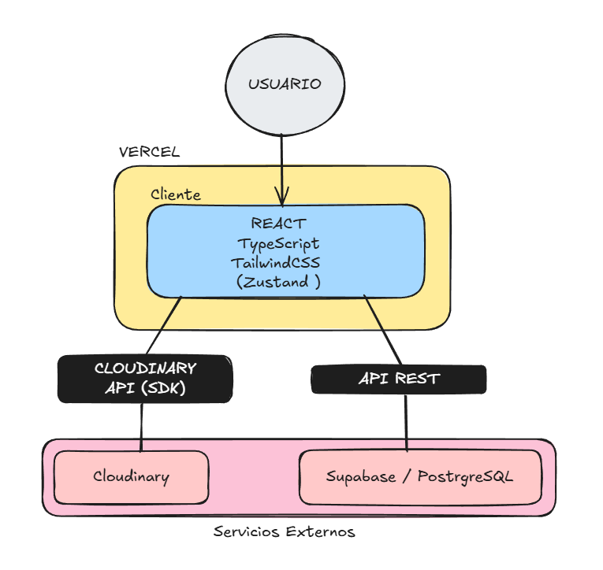

# 🚀 DevSetup Builder

> **Una aplicación Full Stack para configurar, presupuestar y gestionar estaciones de trabajo para desarrolladores.**

[](https://reactjs.org/)
[](https://www.typescriptlang.org/)
[](https://tailwindcss.com/)
[](https://supabase.com/)
[](https://github.com/pmndrs/zustand)

---

## 🔗 Live Demo
👉 **[Ver Proyecto Desplegado Aquí](https://dev-setup-builder.vercel.app)**

---

## 💡 Sobre el Proyecto

Este proyecto fue desarrollado como una solución técnica para un problema común: la planificación de presupuesto para hardware. La aplicación permite a los usuarios seleccionar componentes, visualizar su presupuesto en tiempo real y a los administradores gestionar el inventario.

El objetivo principal fue implementar una **arquitectura escalable**, separar la lógica de negocio de la UI y conectar servicios modernos en la nube.

## ✨ Características Clave

* **🛒 Calculadora de Presupuesto en Tiempo Real:** Gestión de estado global con Zustand para calcular remanentes y alertas visuales.
* **🛡️ Panel de Administración (CRUD):** Interfaz protegida para crear y eliminar productos del inventario.
* **☁️ Gestión de Imágenes:** Integración con **Cloudinary** para subida y optimización de imágenes.
* **🗄️ Persistencia de Datos:** Conexión con **Supabase (PostgreSQL)** para sincronización de inventario.
* **🎨 UI/UX Moderna:** Diseño "Dark Mode First" inspirado en Vercel, utilizando TailwindCSS y componentes modulares.

---

## 🏗️ Arquitectura del Sistema

La aplicación sigue un flujo **Serverless**. El frontend interactúa directamente con los servicios en la nube para maximizar el rendimiento y reducir la latencia.



### Decisiones de Diseño

* **Feature-Based Architecture:** En lugar de agrupar archivos por tipo (components, hooks), el proyecto está organizado por dominios (`features/catalog`, `features/admin`, `features/budget`). Esto facilita la escalabilidad y el mantenimiento.
* **Zustand vs Context/Redux:** Se eligió Zustand por su simplicidad, menor boilerplate y facilidad para manejar actualizaciones de estado asíncronas fuera del ciclo de renderizado de React.

---

## 🛠️ Stack Tecnológico

* **Frontend Core:** React 18, TypeScript, Vite.
* **Estilos:** TailwindCSS, clsx, tailwind-merge (para utilidades de clases dinámicas).
* **Estado:** Zustand (Global Store).
* **Routing:** React Router DOM v6.
* **Backend as a Service:** Supabase (PostgreSQL).
* **Media:** Cloudinary (API de subida de imágenes).
* **Iconos:** Lucide React.
* **Notificaciones:** Sonner.

---

## 📂 Estructura del Proyecto

```text
src/
├── api/                 # Configuración de clientes (Supabase/Axios)
├── features/            # Lógica de Negocio Modular
│   ├── admin/           # Dashboard y Formularios
│   ├── budget/          # Lógica del carrito y presupuesto
│   └── catalog/         # Visualización de productos
├── components/          # UI Genérica (Layouts, Buttons)
├── pages/               # Rutas de la aplicación
├── store/               # Estado Global (Zustand)
└── types/               # Definiciones TypeScript
```

## 🚀 Instalación Local

### Clonar el repositorio:


```Bash
git clone [https://github.com/TU_USUARIO/devsetup-builder.git](https://github.com/TU_USUARIO/devsetup-builder.git)
cd devsetup-builder
```

### Instalar dependencias:

```Bash
  npm install
```
### Configurar Variables de Entorno: Crea un archivo .env en la raíz y agrega tus credenciales:

Fragmento de código

```text
VITE_SUPABASE_URL=tu_supabase_url
VITE_SUPABASE_KEY=tu_supabase_anon_key
VITE_CLOUDINARY_CLOUD_NAME=tu_cloud_name
VITE_CLOUDINARY_PRESET=tu_upload_preset

```

### Ejecutar:

```Bash
npm run dev
```